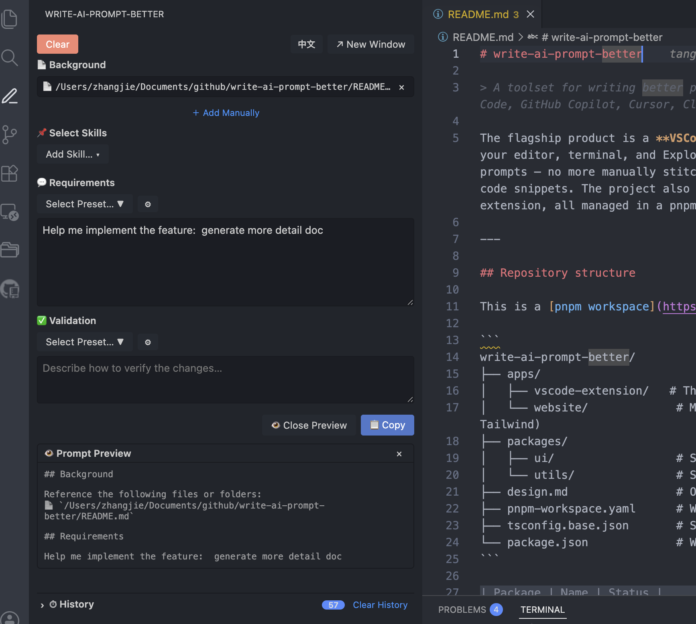

# write-ai-prompt-better

> A toolset for writing better prompts for AI coding assistants — Claude Code, GitHub Copilot, Cursor, Cline, Windsurf, and friends.

The flagship product is a **VSCode extension** that turns right-clicks in your editor, terminal, and Explorer into structured, copy-ready Markdown prompts — no more manually stitching together file paths, line numbers, and code snippets. The project also includes a marketing landing page for the extension, all managed in a pnpm workspace monorepo.



---

## Repository structure

This is a [pnpm workspace](https://pnpm.io/workspaces) monorepo:

```
write-ai-prompt-better/
├── apps/
│   ├── vscode-extension/   # The VSCode extension (core product)
│   └── website/             # Marketing landing page (React + Vite + Tailwind)
├── packages/
│   ├── ui/                  # Shared UI primitives (scaffold)
│   └── utils/               # Shared utilities (scaffold)
├── design.md                # Original project brief
├── pnpm-workspace.yaml      # Workspace definition (apps/*, packages/*)
├── tsconfig.base.json       # Shared TypeScript base config
└── package.json             # Workspace root scripts
```

| Package | Name | Status |
| --- | --- | --- |
| `apps/vscode-extension` | `write-ai-prompt-better` | ✅ Core product — full VSCode extension |
| `apps/website` | `@write-ai-prompt-better/website` | ✅ Landing page — React + Vite + Tailwind, deployed to Cloudflare Pages |
| `packages/ui` | `@write-ai-prompt-better/ui` | 🚧 Scaffold |
| `packages/utils` | `@write-ai-prompt-better/utils` | 🚧 Scaffold |

---

## Prerequisites

- **Node.js** 18+ (required by the VSCode extension's `@types/vscode` / `@types/node`)
- **pnpm** 9.x — the repo pins `pnpm@9.15.0` via `packageManager`

---

## Quick start

```bash
# Install dependencies for every workspace package
pnpm install

# Build all packages (TypeScript → dist/ or out/)
pnpm build

# Watch mode across all packages (parallel)
pnpm dev
```

### Run the VSCode extension

```bash
# One-click: build + package + install to VSCode
pnpm install:extension

# Or build only (TypeScript → out/), then press F5
pnpm build:extension
```

Then open `apps/vscode-extension/` in VSCode and press **F5** to launch the Extension Development Host.

See the extension docs:
- 📄 [`apps/vscode-extension/README.md`](apps/vscode-extension/README.md) — features, usage, configuration
- 📄 [`apps/vscode-extension/design.md`](apps/vscode-extension/design.md) — technical design (Chinese)
- 📄 [`apps/vscode-extension/architecture.md`](apps/vscode-extension/architecture.md) — architecture diagrams

### Develop the website

```bash
# Start Vite dev server (localhost:3000, HMR)
pnpm dev:website

# Production build → apps/website/dist/
pnpm build:website

# Preview production build locally
pnpm preview:website
```

See the website docs:
- 📄 [`apps/website/README.md`](apps/website/README.md) — development and deployment guide
- 📄 [`apps/website/design.md`](apps/website/design.md) — design document and architecture

---

## Workspace scripts

Run from the repository root to operate on every package at once:

| Script | Command | Description |
| --- | --- | --- |
| `build` | `pnpm build` | Build all workspace packages |
| `dev` | `pnpm dev` | Watch mode for all packages in parallel |
| `typecheck` | `pnpm typecheck` | Type-check all packages without emitting |
| `lint` | `pnpm lint` | Lint all packages |

Convenience scripts targeting specific packages:

| Script | Description |
| --- | --- |
| `pnpm dev:website` | Start Vite dev server (HMR, port 3000) |
| `pnpm build:website` | Production build website → `apps/website/dist/` |
| `pnpm preview:website` | Preview built website locally |
| `pnpm dev:extension` | VSCode extension watch mode (`tsc -watch`) |
| `pnpm build:extension` | Build the VSCode extension |
| `pnpm install:extension` | Build + package .vsix + install to VSCode |

To target a single package manually, use pnpm's filter syntax:

```bash
pnpm --filter write-ai-prompt-better run build      # the extension
pnpm --filter @write-ai-prompt-better/website run dev  # the website
```

---

## Tech stack

| Layer | Technology |
| --- | --- |
| Monorepo | pnpm workspaces |
| Language | TypeScript (strict) |
| Extension runtime | VSCode Extension Host (Node.js) |
| Extension UI | Inline HTML + CSS + Vanilla JS (webview) |
| Extension build | `tsc` directly — no bundler |
| Website framework | React 18 + TypeScript |
| Website styles | Tailwind CSS 3.4 (dark mode, responsive) |
| Website build | Vite 5 — outputs static files |
| Website deploy | Cloudflare Pages |

> Note: the workspace root and the shared packages use ES modules (`"type": "module"`), but the VSCode extension is built as **CommonJS** (its `tsconfig.json` overrides the shared base) so it loads correctly in the Extension Host.

---

## Project documents

- [`design.md`](design.md) — original project brief (initialization requirements)
- [`CLAUDE.md`](CLAUDE.md) — AI-assisted development guide
- [`apps/vscode-extension/README.md`](apps/vscode-extension/README.md) — extension features, usage, configuration
- [`apps/vscode-extension/design.md`](apps/vscode-extension/design.md) — extension technical design (Chinese)
- [`apps/vscode-extension/architecture.md`](apps/vscode-extension/architecture.md) — extension architecture diagrams
- [`apps/website/README.md`](apps/website/README.md) — website development and deployment guide
- [`apps/website/design.md`](apps/website/design.md) — website design document and architecture

---

## License

[MIT](LICENSE) © 2026 tangzixuan
