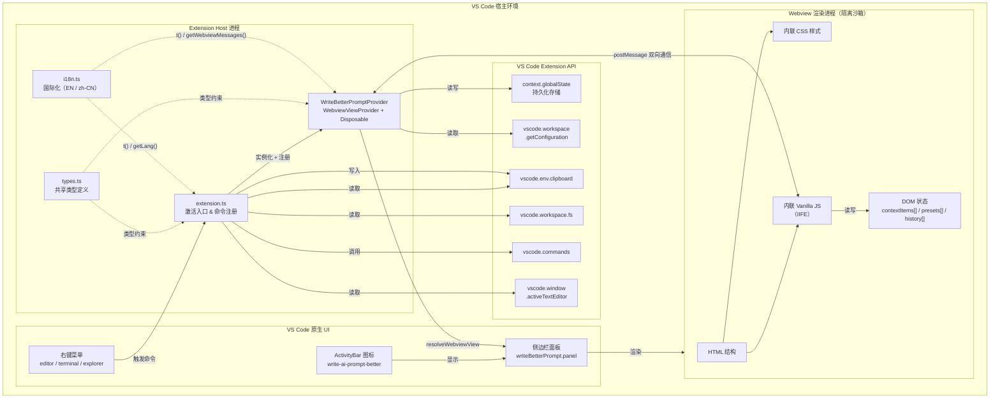
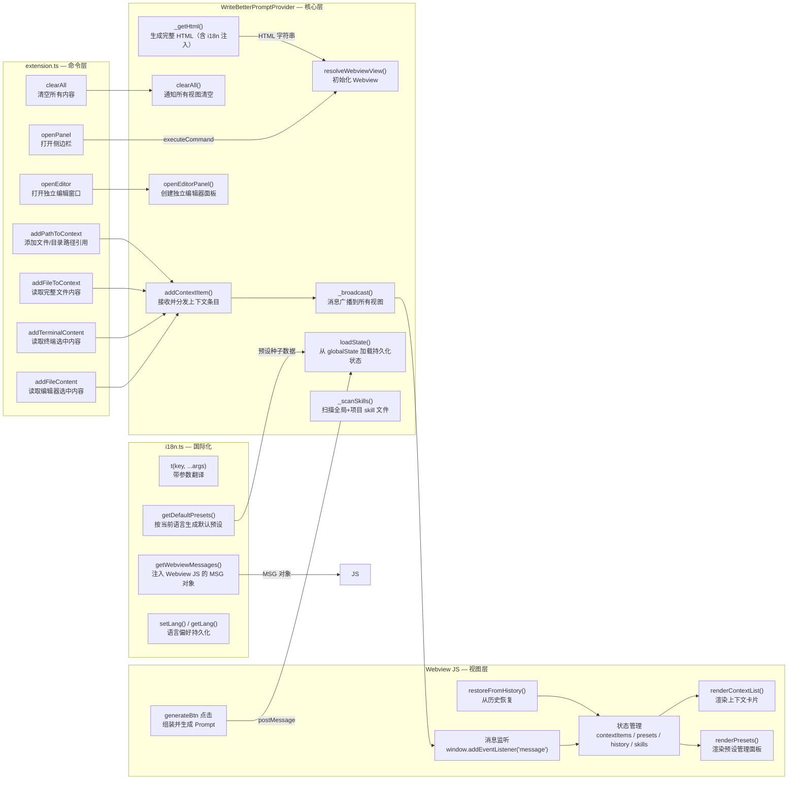
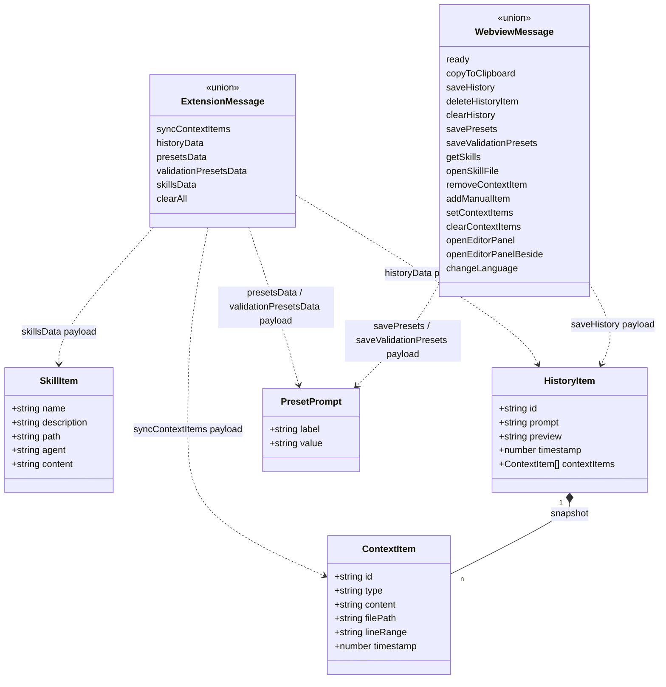

# write-ai-prompt-better — 架构设计图

## 整体架构



---

## 模块职责



---

## 文件结构

```
apps/vscode-extension/
├── src/
│   ├── extension.ts                   # 激活入口，注册 Provider 和 7 个命令
│   ├── WriteBetterPromptProvider.ts   # 核心 Provider，含完整嵌入式 UI (~1150 行)
│   ├── types.ts                       # 共享 TS 类型 (ContextItem / SkillItem / HistoryItem / 消息协议)
│   └── i18n.ts                        # EN / zh-CN 国际化模块
├── media/
│   └── icon.svg                       # ActivityBar 图标（铅笔）
├── scripts/
│   └── build-and-install.sh           # 一键构建 + 打包 + 安装脚本
├── package.json                       # 扩展清单，贡献点配置
├── package.nls.json                   # 清单 i18n 默认语言（EN）
├── package.nls.zh-cn.json             # 清单 i18n 中文翻译
├── tsconfig.json                      # tsc 编译配置（CommonJS）
├── .vscodeignore                      # 打包排除文件
├── LICENSE                            # MIT 许可证
└── out/                               # 编译产物（.js）
```

---

## 技术栈

| 层次 | 技术 |
|------|------|
| 语言 | TypeScript（strict 模式）|
| 运行时 | VS Code Extension Host (Node.js) |
| UI | 原生 HTML + CSS + Vanilla JS（内联嵌入）|
| 构建 | `tsc` 直接编译，无打包器 |
| 存储 | `vscode.ExtensionContext.globalState`（键值对）|
| 安全 | CSP nonce 保护 Webview 脚本 |
| 通信 | `postMessage` 双向消息协议 |
| i18n | 自定义模块，支持 EN / zh-CN，语言偏好持久化 |

---

## 核心类型关系



---

## 上下文类型枚举

| type 值 | 来源命令 | 内容 |
|---------|---------|------|
| `file` | `addFileContent` | 编辑器选中代码块（含文件路径和行号）|
| `file`（全文） | `addFileToContext` | 完整文件内容（标签页右键）|
| `terminal` | `addTerminalContent` | 终端选中文本（含完整内容）|
| `fileRef` | `addPathToContext`（文件）| 仅文件路径引用，不含内容 |
| `folder` | `addPathToContext`（目录）| 目录路径引用，不含内容 |
| `manual` | Webview 内手动输入 | 用户手动填写的自由文本 |

---

## 持久化存储键

| globalState Key | 类型 | 说明 |
|-----------------|------|------|
| `wbp.history` | `HistoryItem[]` | 提示词历史，无上限 |
| `wbp.presets` | `PresetPrompt[]` | 需求预设列表 |
| `wbp.validationPresets` | `PresetPrompt[]` | 验证方法预设列表 |
| `wbp.lang` | `'en' \| 'zh-cn'` | 用户语言偏好 |

---

## VSCode 配置项

| 配置键 | 类型 | 默认值 | 说明 |
| --- | --- | --- | --- |
| `writeBetterPrompt.presets` | `array` | `[]` | 初始需求预设（种子数据；UI 管理的预设优先级更高，保存在 globalState） |

> 通过 ⚙ 面板管理的预设保存在 `globalState`（key: `wbp.presets` / `wbp.validationPresets`），优先级高于 `settings.json`。`settings.json` 仅作为首次安装时的种子数据。内置默认预设由 `i18n.ts` 的 `getDefaultPresets()` 按当前语言生成。
