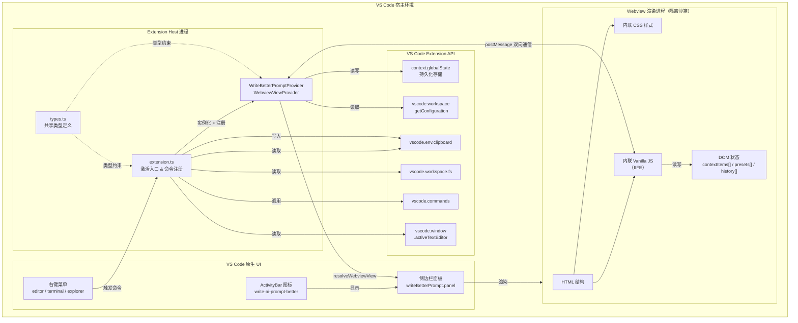
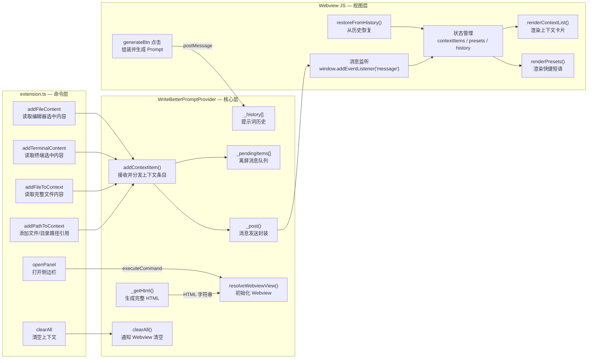
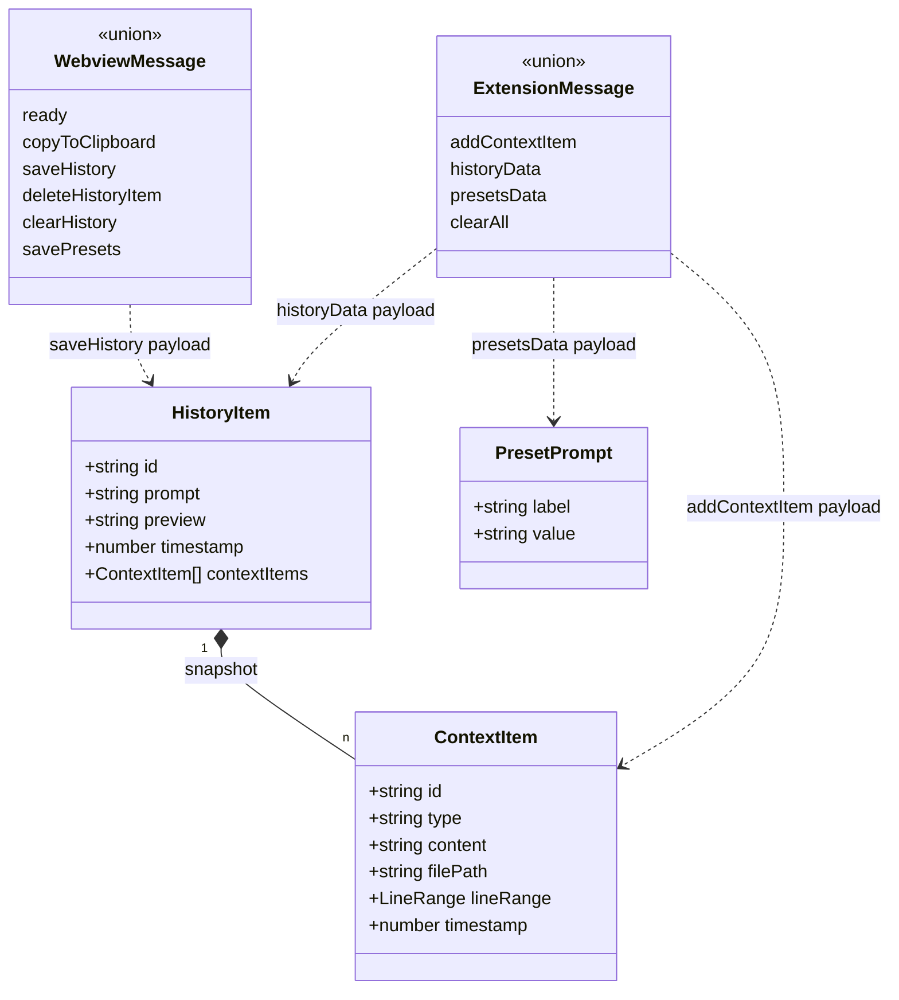

# write-ai-prompt-better — 架构设计图

## 整体架构



---

## 模块职责



---

## 文件结构

```
write-ai-prompt-better-vs-plugin/
├── src/
│   ├── extension.ts              # 激活入口，注册 Provider 和 6 个命令
│   ├── WriteBetterPromptProvider.ts  # 核心 Provider，含完整嵌入式 UI
│   └── types.ts                  # 共享 TS 类型 (ContextItem / HistoryItem / 消息协议)
├── package.json                  # 扩展清单，贡献点配置
├── tsconfig.json                 # tsc 编译配置
├── images/icon.png               # ActivityBar 图标
└── out/                          # 编译产物（.js）
```

---

## 技术栈

| 层次 | 技术 |
|------|------|
| 语言 | TypeScript（strict 模式）|
| 运行时 | VS Code Extension Host (Node.js) |
| UI | 原生 HTML + CSS + Vanilla JS（内联嵌入）|
| 构建 | `tsc` 直接编译，无打包器 |
| 存储 | `vscode.ExtensionContext.globalState`（键值对）|
| 安全 | CSP nonce 保护 Webview 脚本 |
| 通信 | `postMessage` 双向消息协议 |

---

## 核心类型关系



---

## 上下文类型枚举

| type 值 | 来源命令 | 内容 |
|---------|---------|------|
| `file` | addFileContent | 编辑器选中代码块（含文件路径和行号）|
| `terminal` | addTerminalContent | 终端选中文本 |
| `file`（全文）| addFileToContext | 完整文件内容 |
| `fileRef` | addPathToContext（文件）| 仅文件路径引用 |
| `folder` | addPathToContext（目录）| 目录路径引用 |
| `manual` | Webview 内手动输入 | 用户手动填写的上下文 |
